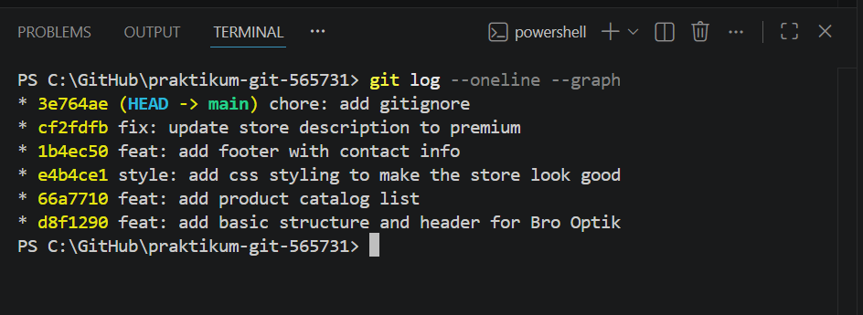
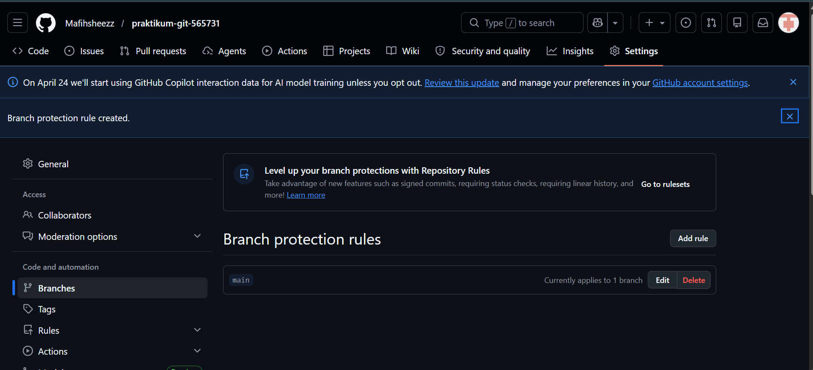
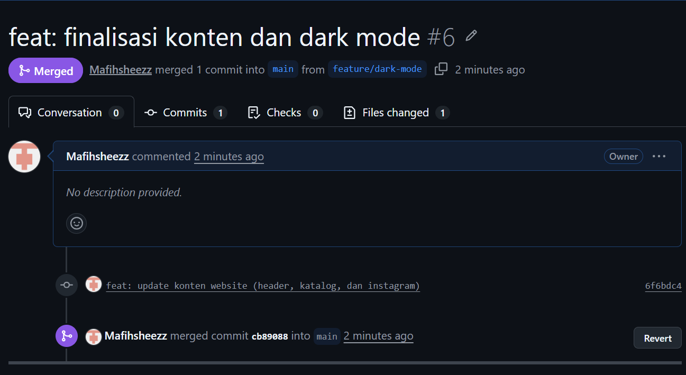

# Laporan Praktikum Git - Bro Optik

**Nama:** [Muhammad Faqih Ghufron]  
**NIM:** 565731

## Hasil Praktikum
Saya telah menyelesaikan praktikum Git dengan total 6 commit utama, termasuk penambahan konten HTML, styling CSS, dan konfigurasi .gitignore.

### Riwayat Commit (Git Log)
Berikut adalah bukti riwayat commit yang telah saya lakukan:

## Dokumentasi Tugas 2
Berikut adalah bukti bahwa Branch Protection Rule telah diaktifkan untuk branch `main`:

## Bukti Tugas 3
Berikut adalah hasil Interactive Rebase (Squash) yang menggabungkan 3 commit menjadi 1:

