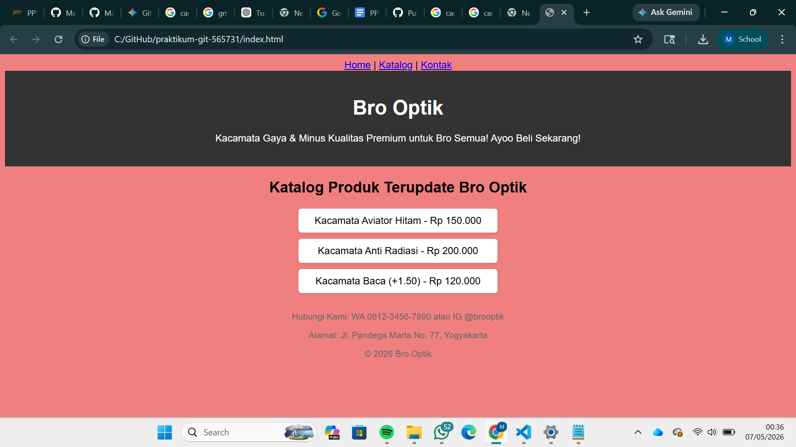

# Laporan Praktikum Git - Bro Optik

**Nama:** [Muhammad Faqih Ghufron]  
**NIM:** 565731

## Deskripsi Project
Website katalog sederhana "Bro Optik" yang dikembangkan untuk mempraktikkan penggunaan Git dan GitHub. Proyek ini mencakup alur kerja dari inisialisasi repository, branching, manajemen konflik, hingga penggunaan fitur kolaborasi GitHub.

## Cara Menjalankan
1. Clone repository ini: `git clone https://github.com/Mafihsheezz/praktikum-git-565731.git`
2. Buka folder proyek di dalam VS Code.
3. Buka file `index.html` menggunakan browser (klik dua kali filenya) atau jalankan menggunakan ekstensi Live Server.

## Screenshot Website

## Dokumentasi Perintah Git yang Digunakan
* `git init`: Menginisialisasi repository Git baru di folder lokal.
* `git add .` / `git add <nama-file>`: Menambahkan perubahan file ke staging area.
* `git commit -m "pesan"`: Menyimpan perubahan dari staging area ke dalam riwayat lokal.
* `git branch <nama-branch>`: Membuat cabang baru untuk fitur eksperimen.
* `git checkout <nama-branch>`: Berpindah dari satu cabang ke cabang lainnya.
* `git merge <nama-branch>`: Menggabungkan cabang (misal: fitur) ke cabang saat ini (`main`).
* `git push origin <nama-branch>`: Mengirim commit dari laptop ke server GitHub.
* `git pull origin main`: Mengambil pembaruan kode terbaru dari server GitHub ke laptop.
* `git rebase -i HEAD~3`: Merapikan dan menggabungkan (squash) beberapa commit menjadi satu pesan yang rapi.

---

## Hasil Praktikum
Saya telah menyelesaikan praktikum Git dengan total 6 commit utama, termasuk penambahan konten HTML, styling CSS, dan konfigurasi .gitignore.

### Riwayat Commit (Git Log)
Berikut adalah bukti riwayat commit yang telah saya lakukan:

## Dokumentasi Tugas 2
Berikut adalah bukti bahwa Branch Protection Rule telah diaktifkan untuk branch `main`:

## Dokumentasi Tugas 3

